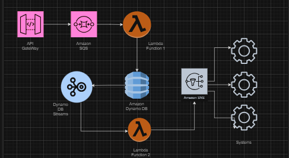
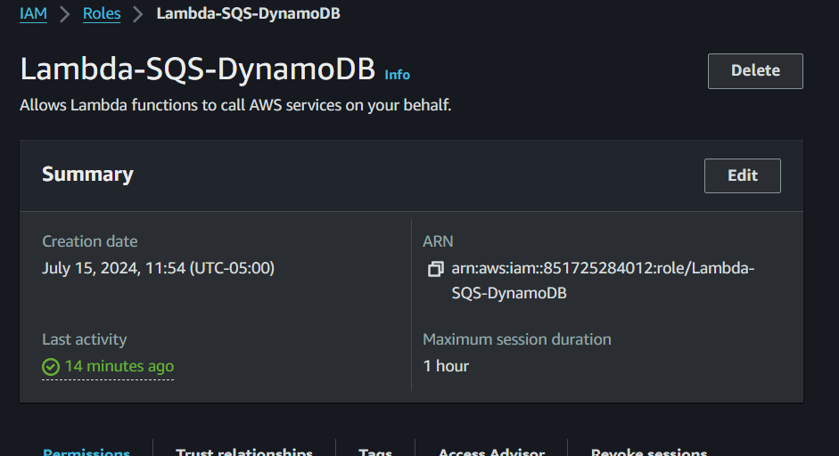

# Serverless Web Backend on AWS

## Project Overview

This project demonstrates a serverless web backend architecture using various AWS services. The architecture is designed to handle spikes in demand efficiently and ensure decoupled application components. The solution was implemented for a hypothetical customer who sells cleaning supplies and experiences fluctuating web traffic.

## Architecture

The architecture involves:
- Using a REST API to place entries into an Amazon SQS queue.
- Triggering AWS Lambda functions to process and store the entries in an Amazon DynamoDB table.
- Capturing database modifications with DynamoDB Streams.
- Using another Lambda function to send notifications via Amazon SNS.

## AWS Services Used
- AWS Identity and Access Management (IAM)
- Amazon DynamoDB
- AWS Lambda
- Amazon Simple Queue Service (SQS)
- Amazon Simple Notification Service (SNS)
- Amazon API Gateway
- Amazon CloudWatch Logs

## Implementation Details

### 1. IAM Policies and Roles
Custom IAM policies and roles were created to follow best practices and provide limited access permissions:
- **Lambda-Write-DynamoDB**: Allows Lambda to write to DynamoDB.
- **Lambda-SNS-Publish**: Allows Lambda to publish to SNS.
- **Lambda-DynamoDBStreams-Read**: Allows Lambda to read from DynamoDB Streams.
- **Lambda-Read-SQS**: Allows Lambda to read from SQS.

### 2. DynamoDB Table
An Amazon DynamoDB table named `orders` was created to store order data, with `orderID` as the partition key.

### 3. SQS Queue
An Amazon SQS queue named `POC-Queue` was set up to receive data from the API Gateway.

### 4. Lambda Functions and Triggers
Two AWS Lambda functions were implemented:
- **POC-Lambda-1**: Reads messages from SQS and writes order records to DynamoDB.
- **POC-Lambda-2**: Uses DynamoDB Streams to trigger when a new record is added and sends a notification via SNS.

### 5. DynamoDB Streams
DynamoDB Streams were enabled to capture modifications in the `orders` table and trigger the second Lambda function.

### 6. SNS Topic and Subscriptions
An SNS topic named `POC-Topic` was created, and email subscriptions were set up to receive notifications about new database entries.

### 7. API Gateway
A REST API was created using Amazon API Gateway to serve as the communication gateway. It integrates with SQS to send order data to the backend.

### 8. Testing
The architecture was tested by sending mock data through the API Gateway, verifying data insertion into DynamoDB, and confirming email notifications via SNS.

### 9. Cleanup
All resources created for this project were deleted to avoid unnecessary charges, including the DynamoDB table, Lambda functions, SQS queue, SNS topic, API Gateway, IAM roles, and policies.

## Conclusion
This project demonstrates a comprehensive serverless solution on AWS, showcasing skills in creating and managing cloud infrastructure, designing scalable architectures, and implementing best practices for security and resource management. The implementation ensures efficient handling of high-demand scenarios with decoupled components, making it a robust and scalable solution for web backends.
